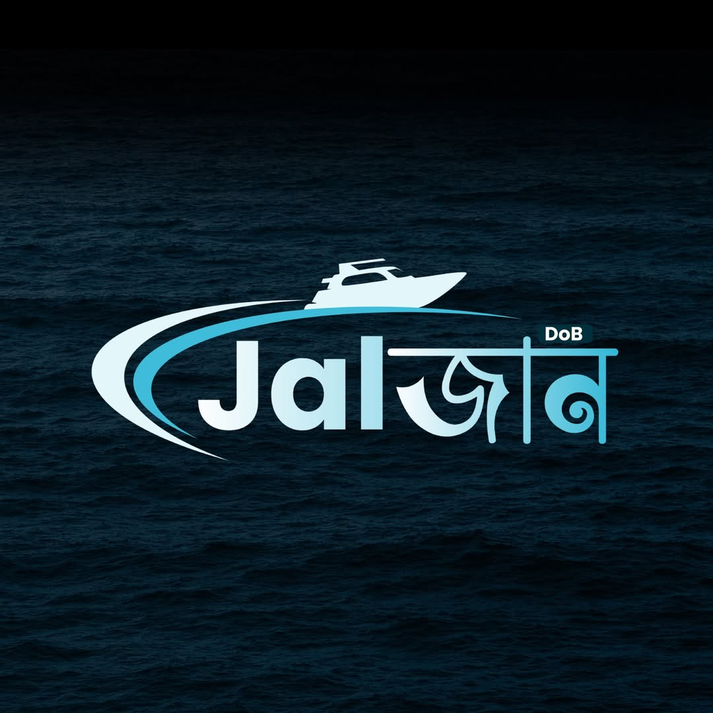

# Dreams of Bangladesh - RoboBoat 2026 Website

Official website for **DoB Joljan**, the autonomous surface vehicle developed by Dreams of Bangladesh for the RoboBoat 2026 international competition.



## 🌐 About

This website showcases our team's journey, technical achievements, and participation in RoboBoat 2026 - Storm Response. It features our autonomous surface vehicle (ASV), team members, projects, blog updates, and contact information.

**Live Features:**
- Video background entrance animation
- Dynamic hero section with boat video
- Responsive design (mobile, tablet, desktop)
- Dark/Light theme toggle
- Smooth page transitions
- Modern glass-morphism UI

---

## 🚀 Technology Stack

- **Framework**: React 19.2.0
- **Build Tool**: Vite 7.2.4
- **Routing**: React Router DOM 7.11.0
- **Animations**: Framer Motion 12.23.28
- **Icons**: React Icons 5.5.0
- **Styling**: CSS3 with custom properties
- **Language**: JavaScript (ES6+)

---

## 📁 Project Structure

```
JOLJAN/
├── public/
│   ├── Joljan.mp4          # Background video for hero & loading
│   ├── joljan.jpg          # Team/boat image
│   └── vite.svg            # Vite logo
├── src/
│   ├── components/         # Reusable components
│   │   ├── AnimatedSection.jsx    # Scroll animation wrapper
│   │   ├── GlassCard.jsx         # Glass-morphism card
│   │   ├── Header.jsx            # Navigation header
│   │   ├── Footer.jsx            # Site footer
│   │   └── LoadingScreen.jsx     # Entrance animation
│   ├── context/
│   │   └── ThemeContext.jsx      # Dark/Light theme provider
│   ├── pages/              # Main page components
│   │   ├── Home.jsx              # Landing page
│   │   ├── RoboBoat.jsx          # Competition info
│   │   ├── Boat.jsx              # DoB Joljan technical details
│   │   ├── Team.jsx              # Team members
│   │   ├── Projects.jsx          # Past & current projects
│   │   ├── Blog.jsx              # Updates & posts
│   │   ├── Gallery.jsx           # Photo gallery
│   │   └── Contact.jsx           # Contact form
│   ├── styles/             # CSS files for each component/page
│   │   ├── Home.css
│   │   ├── RoboBoat.css
│   │   ├── Boat.css
│   │   ├── Team.css
│   │   ├── Projects.css
│   │   ├── Blog.css
│   │   ├── Contact.css
│   │   ├── Header.css
│   │   ├── Footer.css
│   │   ├── GlassCard.css
│   │   └── LoadingScreen.css
│   ├── App.jsx             # Main app component
│   ├── App.css             # Global app styles
│   ├── index.css           # Global CSS reset & variables
│   └── main.jsx            # React entry point
├── index.html              # HTML template
├── package.json            # Dependencies
└── vite.config.js          # Vite configuration
```

---

## 🛠️ Setup & Installation

### Prerequisites
- Node.js (v16 or higher)
- npm or yarn

### Installation Steps

1. **Clone the repository**
```bash
cd /path/to/JOLJAN
```

2. **Install dependencies**
```bash
npm install
```

3. **Start development server**
```bash
npm run dev
```

4. **Build for production**
```bash
npm run build
```

5. **Preview production build**
```bash
npm preview
```

The development server will run on `http://localhost:5173`

---

## 📄 Pages Overview

### 🏠 **Home Page** (`/`)
**Purpose:** First impression and quick overview

**Sections:**
- **Hero Section**: Video background with DoB Joljan title, tagline, and CTA buttons
- **Introduction Video**: Placeholder for team overview video
- **About Dreams of Bangladesh**: Who we are, why RoboBoat, our vision
- **Quick Navigation Cards**: Links to RoboBoat 2026, The Boat, The Team, Projects
- **Stats Section**: Key metrics about the project
- **Footer**: Social media links and contact info

**Key Features:**
- Looping `Joljan.mp4` video background
- Gradient overlay for text readability
- Animated entrance on scroll
- Responsive on all devices

---

### 🏆 **RoboBoat 2026** (`/roboboat`)
**Purpose:** Explain the competition to judges, sponsors, and visitors

**Sections:**
- **What is RoboBoat?**: Competition overview and history
- **Why RoboBoat Matters**: Real-world maritime autonomy impact
- **Competition Structure**: Storm Response theme, qualification rounds
- **Autonomy Challenges**: 
  - Evacuation Route & Return
  - Debris Clearance
  - Emergency Response Sprint
  - Supply Drop
  - Navigate the Marina
  - Harbor Alert
- **Our Strategy**: Team approach, safety focus, collaboration

**Content Highlights:**
- Official RoboBoat 2026 information
- Storm Response disaster recovery theme
- Detailed challenge descriptions
- Team's competitive strategy

---

### 🚤 **The Boat - DoB Joljan** (`/boat`)
**Purpose:** Technical documentation and specifications

**Sections:**
- **Design Philosophy**: Project approach and innovation
- **Technical Specifications**: Dimensions, weight, hull type, material
- **Detailed Systems**:
  - Hull & Mechanical Design
  - Propulsion System
  - Power System
  - Navigation & Control
  - Perception System (Cameras, LiDAR)
  - Computing Platform
  - Communication
  - Safety Systems
- **3D Design Section**: Placeholders for models and renders

**Technical Details:**
- Complete system architecture
- Hardware specifications
- Software stack
- Safety features and redundancy

---

### 👥 **The Team** (`/team`)
**Purpose:** Showcase team members and build trust

**Sections:**
- **Group Photo**: Team photo placeholder
- **Department Sections**:
  - Mechanical Team
  - Electrical Team
  - Software & Autonomy Team
  - Management & Documentation Team
- **Member Cards**: Photo, name, position, responsibility
- **Team Stats**: Members, departments, hours worked
- **Join Us CTA**: Recruitment call-to-action

**Features:**
- Department-wise organization
- Individual member profiles
- Photo placeholders for easy updates

---

### 🔧 **Projects** (`/projects`)
**Purpose:** Showcase experience and past work

**Sections:**
- **Featured Project**: RoboBoat 2026 - DoB Joljan
  - Technologies: Autonomous Navigation, Python, C++, OpenCV, Computer Vision, etc.
  - Highlights: Storm Response, obstacle detection, safety-first design
- **Past Projects**: 6 previous robotics projects with descriptions
- **Competition History**: Timeline of achievements
- **Learning & Growth**: Skills gained through the project

**Content:**
- Project descriptions with technologies used
- Outcomes and learnings
- Competition participation history

---

### 📝 **Blog** (`/blog`)
**Purpose:** Document journey and share insights

**Sections:**
- **Category Filters**: Weekly Updates, Testing Days, Design Decisions, Lessons Learned
- **Blog Posts**: 12 sample posts covering:
  - Weekly build updates
  - Testing day reports
  - Design decision rationale
  - Competition preparation
  - Lessons learned
- **Newsletter Subscription**: Email signup form

**Features:**
- Categorized posts
- Search/filter capability
- Responsive card layout
- Tags for each post

---

### 📸 **Gallery** (`/gallery`)
**Purpose:** Visual showcase of boat and team

**Status:** Template ready for image uploads

**Recommended Content:**
- Boat photos (water tests, assembly, details)
- Team photos (workshops, testing, group)
- Competition photos
- Behind-the-scenes

---

### 📞 **Contact** (`/contact`)
**Purpose:** Communication and inquiries

**Sections:**
- **Contact Information**:
  - Email: dreamsofbangladesh@gmail.com
  - Location: Dhaka, Bangladesh
- **Contact Form**: Name, email, subject, message
- **Social Media Links**:
  - Facebook: https://www.facebook.com/profile.php?id=100093129397984
  - Instagram: https://www.instagram.com/dreams_of_bangladesh
  - LinkedIn (placeholder)
  - YouTube (placeholder)
- **About Banner**: Team description

**Features:**
- Functional contact form
- Direct social media links
- Professional layout

---

## 🎨 Design System

### Color Palette

**Primary Colors:**
- Purple: `#667eea`
- Pink: `#764ba2`
- Gradient: `linear-gradient(135deg, #667eea 0%, #764ba2 100%)`

**Accent Colors:**
- Blue: `#4facfe`
- Green: `#43e97b`
- Orange: `#ffa751`
- Pink: `#f093fb`

**Neutral Colors:**
- Dark Background: `#0a0e27`
- Light Background: `#f5f7fa`
- Text Dark: `rgba(255, 255, 255, 0.95)`
- Text Light: `rgba(0, 0, 0, 0.9)`

### Typography

**Font Family:** System fonts for optimal performance
```css
font-family: -apple-system, BlinkMacSystemFont, 'Segoe UI', Roboto, Oxygen, Ubuntu, Cantarell, sans-serif;
```

**Font Sizes:**
- Hero Title: `4rem` (64px)
- Section Title: `2.5rem` (40px)
- Subtitle: `1.2rem` (19.2px)
- Body Text: `1rem` (16px)

### Glass-morphism Effect
```css
background: rgba(255, 255, 255, 0.05);
backdrop-filter: blur(10px);
border: 1px solid rgba(255, 255, 255, 0.1);
border-radius: 20px;
```

---

## 🎬 Video Integration

### Background Video
**File:** `public/Joljan.mp4`

**Used In:**
1. **Loading Screen**: Full-screen entrance animation
2. **Hero Section**: Landing page background

**Implementation:**
```jsx
<video className="hero-video" autoPlay loop muted playsInline>
  <source src="/Joljan.mp4" type="video/mp4" />
</video>
```

**CSS Styling:**
```css
.hero-video {
  position: absolute;
  top: 50%;
  left: 50%;
  min-width: 100%;
  min-height: 100%;
  width: auto;
  height: auto;
  transform: translate(-50%, -50%);
  object-fit: cover;
  z-index: 0;
}
```

**Overlay for Readability:**
```css
.hero-overlay {
  background: linear-gradient(
    to bottom,
    rgba(0, 0, 0, 0.7) 0%,
    rgba(0, 0, 0, 0.5) 50%,
    rgba(0, 0, 0, 0.7) 100%
  );
}
```

---

## 🔧 Customization Guide

### 1. Update Team Information

**File:** `src/pages/Team.jsx`

```javascript
const departments = [
  {
    id: 'mechanical',
    icon: <FiTool />,
    name: 'Mechanical Team',
    members: [
      {
        name: 'Your Name',
        role: 'Mechanical Lead',
        responsibility: 'Your responsibility'
      },
      // Add more members
    ]
  },
  // More departments
];
```

### 2. Add Blog Posts

**File:** `src/pages/Blog.jsx`

```javascript
const posts = [
  {
    title: 'Your Post Title',
    date: 'January 15, 2026',
    author: 'Author Name',
    category: 'Weekly Updates',
    categoryColor: '#43e97b',
    excerpt: 'Your post excerpt...',
    image: '🚤',
    tags: ['Tag1', 'Tag2', 'Tag3']
  },
  // More posts
];
```

### 3. Update Projects

**File:** `src/pages/Projects.jsx`

Update the `pastProjects` array with your actual projects.

### 4. Change Colors

**File:** `src/index.css`

```css
:root {
  --primary-color: #667eea;
  --secondary-color: #764ba2;
  --accent-color: #43e97b;
}
```

### 5. Add Images

**Location:** `public/` folder

**Update in code:**
```jsx

```

### 6. Update Contact Information

**Files:** 
- `src/pages/Contact.jsx`
- `src/components/Footer.jsx`

Update email, social media links, and location.

---

## 📱 Responsive Design

The website is fully responsive with breakpoints:

- **Desktop**: > 1024px
- **Tablet**: 768px - 1024px
- **Mobile**: < 768px
- **Small Mobile**: < 480px

**Key Features:**
- Fluid typography
- Flexible grid layouts
- Touch-friendly navigation
- Optimized video playback on mobile

---

## 🌓 Theme System

### Dark Theme (Default)
- Background: Dark blue gradients
- Text: White/light colors
- Cards: Transparent glass effect

### Light Theme
- Background: Light gray/white
- Text: Dark colors
- Cards: White with subtle shadows

**Toggle Implementation:**
```jsx
import { useTheme } from './context/ThemeContext';

const { isDark, toggleTheme } = useTheme();
```

---

## 🚀 Deployment

### Build for Production

```bash
npm run build
```

This creates an optimized build in the `dist/` folder.

### Deployment Options

#### 1. **Vercel** (Recommended)
```bash
npm install -g vercel
vercel
```

#### 2. **Netlify**
- Connect GitHub repository
- Build command: `npm run build`
- Publish directory: `dist`

#### 3. **GitHub Pages**
```bash
npm install gh-pages --save-dev
```

Add to `package.json`:
```json
"homepage": "https://yourusername.github.io/JOLJAN",
"scripts": {
  "predeploy": "npm run build",
  "deploy": "gh-pages -d dist"
}
```

Deploy:
```bash
npm run deploy
```

#### 4. **Custom Server**
Upload contents of `dist/` folder to your web server.

---

## 🐛 Troubleshooting

### Video Not Playing

**Issue:** Video doesn't autoplay on mobile browsers

**Solution:** 
- Ensure `muted` attribute is present
- Add `playsInline` attribute
- Check browser autoplay policies

### Slow Loading

**Issue:** Website loads slowly

**Solutions:**
- Compress video file (use H.264 codec)
- Optimize images (use WebP format)
- Enable lazy loading for images
- Use CDN for assets

### Theme Not Persisting

**Issue:** Theme resets on page reload

**Solution:** Add localStorage persistence in `ThemeContext.jsx`:
```javascript
useEffect(() => {
  const savedTheme = localStorage.getItem('theme');
  if (savedTheme) setIsDark(savedTheme === 'dark');
}, []);

useEffect(() => {
  localStorage.setItem('theme', isDark ? 'dark' : 'light');
}, [isDark]);
```

### Navigation Not Working

**Issue:** Routes don't work on production

**Solution:** Configure server for SPA routing
- Add `_redirects` file (Netlify): `/* /index.html 200`
- Add `vercel.json` (Vercel):
```json
{
  "rewrites": [{ "source": "/(.*)", "destination": "/" }]
}
```

---

## 📦 Dependencies

### Production Dependencies
```json
{
  "framer-motion": "^12.23.28",    // Animations
  "react": "^19.2.0",               // UI library
  "react-dom": "^19.2.0",           // React DOM
  "react-icons": "^5.5.0",          // Icon library
  "react-router-dom": "^7.11.0"    // Routing
}
```

### Development Dependencies
```json
{
  "@eslint/js": "^9.39.1",          // Linting
  "@vitejs/plugin-react": "^5.1.1", // Vite React plugin
  "eslint": "^9.39.1",               // Code quality
  "vite": "^7.2.4"                   // Build tool
}
```

---

## 🔐 Environment Variables

Create `.env` file for sensitive data:

```env
VITE_CONTACT_EMAIL=dreamsofbangladesh@gmail.com
VITE_FACEBOOK_URL=https://www.facebook.com/profile.php?id=100093129397984
VITE_INSTAGRAM_URL=https://www.instagram.com/dreams_of_bangladesh
```

Access in code:
```javascript
const email = import.meta.env.VITE_CONTACT_EMAIL;
```

---

## 📝 Content Updates Checklist

- [ ] Replace placeholder images with actual photos
- [ ] Add team member photos and details
- [ ] Upload boat testing videos
- [ ] Write blog posts with updates
- [ ] Add gallery images
- [ ] Update technical specifications
- [ ] Add competition results (post-competition)
- [ ] Update social media links
- [ ] Add sponsor logos (if applicable)
- [ ] Create favicon/logo files

---

## 🤝 Contributing

### Team Members
1. Fork the repository
2. Create feature branch: `git checkout -b feature/YourFeature`
3. Commit changes: `git commit -m 'Add some feature'`
4. Push to branch: `git push origin feature/YourFeature`
5. Open pull request

### Code Style
- Use ESLint for code linting
- Follow React best practices
- Write clean, commented code
- Test on multiple devices before committing

---

## 📞 Support & Contact

**Team Email:** dreamsofbangladesh@gmail.com

**Social Media:**
- Facebook: [Dreams Of Bangladesh](https://www.facebook.com/profile.php?id=100093129397984)
- Instagram: [@dreams_of_bangladesh](https://www.instagram.com/dreams_of_bangladesh)

**Location:** Dhaka, Bangladesh

---

## 📄 License

This project is created for Dreams of Bangladesh RoboBoat 2026 team.

---

## 🙏 Acknowledgments

- **RoboNation** - For organizing RoboBoat competition
- **Team Members** - For dedication and hard work
- **Sponsors** - For supporting the project
- **Community** - For encouragement and support

---

## 📊 Project Status

**Version:** 1.0.0  
**Status:** ✅ Active Development  
**Competition Date:** Summer 2026  
**Last Updated:** January 2026

---

**Built with ❤️ by Dreams of Bangladesh Team**

🚤 *Innovation on Water. Teamwork on Land.*
